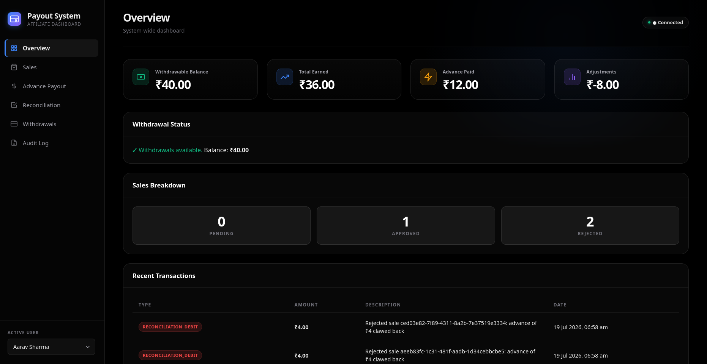
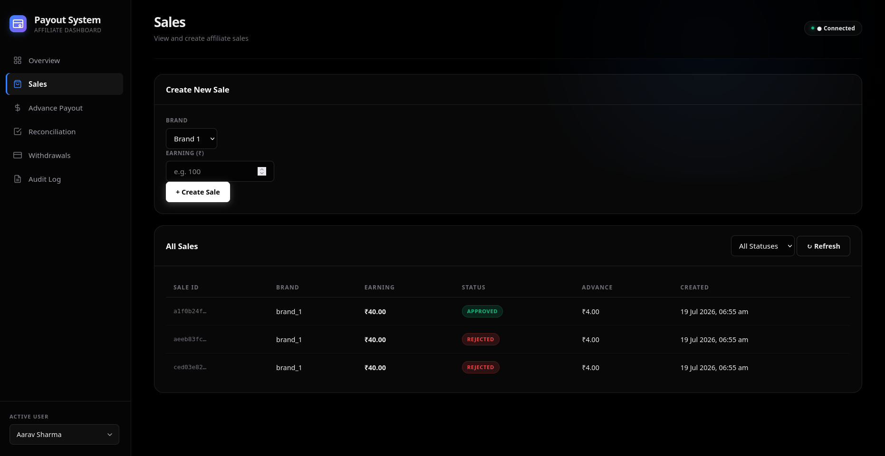
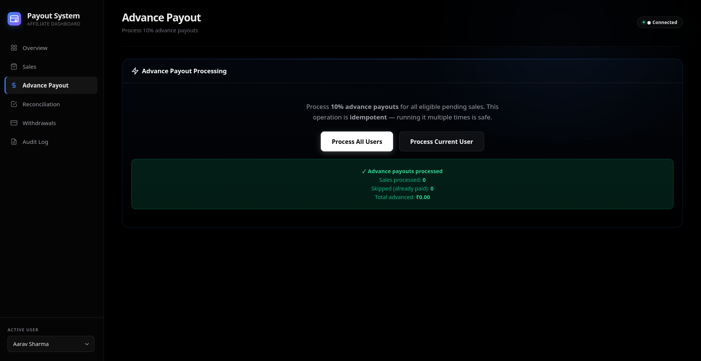
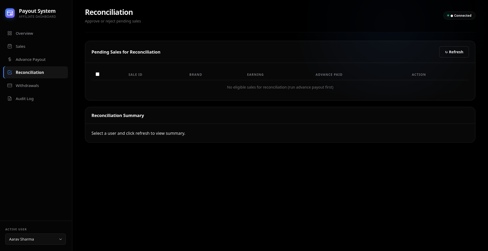
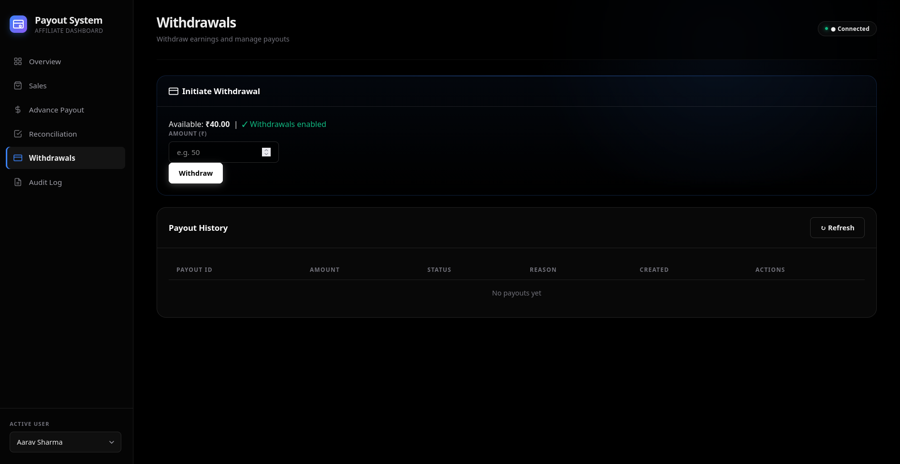
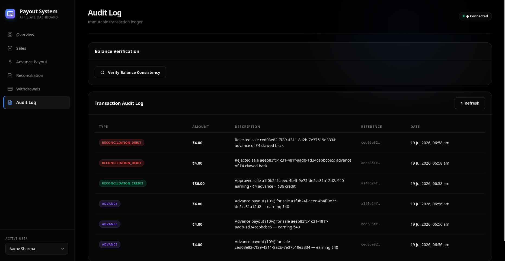

# User Payout Management System

> Low-Level Design (LLD) implementation for managing user payouts in an affiliate sales platform.

Built with **JavaScript (Node.js)**, **Express.js**, and **SQLite**.

---

## Table of Contents

- [Overview](#overview)
- [Screenshots](#screenshots)
- [Architecture](#architecture)
- [Database Schema](#database-schema)
- [API Reference](#api-reference)
- [Business Rules](#business-rules)
- [Design Decisions & Trade-offs](#design-decisions--trade-offs)
- [Edge Cases & Failure Handling](#edge-cases--failure-handling)
- [Quick Start](#quick-start)
- [Testing](#testing)
- [Project Structure](#project-structure)

---

## Overview

This system manages the complete lifecycle of affiliate sale payouts:

1. **Sales enter as `pending`** when a product is purchased
2. **Advance payouts** of 10% are disbursed to users (idempotent)
3. **Admin reconciliation** approves or rejects sales
4. **Final payouts** are calculated (approved: earn - advance; rejected: claw back advance)
5. **Withdrawals** respect a 24-hour cooldown
6. **Failed payouts** are automatically credited back to the user's balance

### Example (from Assignment)

```
3 Sales × ₹40 each = ₹120 total pending
Advance = 10% × ₹120 = ₹12 (₹4 per sale)

After reconciliation (1 rejected, 2 approved):
  Rejected: -₹4 (advance clawed back)
  Approved: +₹36 (₹40 - ₹4)
  Approved: +₹36 (₹40 - ₹4)

Final Payout = -₹4 + ₹36 + ₹36 = ₹68
```

---

## Screenshots

<details>
<summary>Click to view screenshots</summary>

### Dashboard Overview


### Sale Processing



### Reconciliation



### Withdrawal & Audit Log


</details>

---

## Architecture

```
┌─────────────────────────────────────────────────────────┐
│                     REST API Layer                       │
│  /api/sales  /api/advance  /api/reconciliation          │
│  /api/payouts  /api/balance                             │
├─────────────────────────────────────────────────────────┤
│                    Service Layer                         │
│  AdvancePayoutService  ReconciliationService             │
│  WithdrawalService                                       │
├─────────────────────────────────────────────────────────┤
│                     Model Layer                          │
│  Sale  UserBalance  Payout  PayoutTransaction           │
├─────────────────────────────────────────────────────────┤
│                   Database (SQLite)                       │
│  users │ brands │ sales │ user_balances │ payouts       │
│  payout_transactions │ reconciliation_logs               │
└─────────────────────────────────────────────────────────┘
```

### Class/Module Diagram

```
AdvancePayoutService
├── Uses: Sale.findEligibleForAdvance()
├── Uses: Sale.markAdvancePaid()          ← Idempotency guard
├── Uses: UserBalance.creditAdvance()
└── Uses: PayoutTransaction.create()

ReconciliationService
├── Uses: Sale.updateStatus()             ← Status transition validation
├── Uses: UserBalance.creditReconciliation()  (approved)
├── Uses: UserBalance.debitAdjustment()       (rejected)
└── Uses: PayoutTransaction.create()

WithdrawalService
├── Uses: UserBalance.canWithdraw()       ← 24-hour enforcement
├── Uses: Payout.create()
├── Uses: UserBalance.debitWithdrawal()
├── Uses: UserBalance.creditReversal()    ← Failed payout recovery
└── Uses: PayoutTransaction.create()
```

---

## Database Schema

### Entity-Relationship Diagram

```
┌──────────┐     ┌──────────┐     ┌───────────────┐
│  users   │────<│  sales   │>────│    brands     │
│          │     │          │     │               │
│ id (PK)  │     │ id (PK)  │     │ id (PK)      │
│ name     │     │ user_id  │     │ name          │
│ email    │     │ brand_id │     └───────────────┘
└────┬─────┘     │ status   │
     │           │ earning  │
     │           │ advance_ │
     │           │   paid   │
     │           │ advance_ │
     │           │   amount │
     │           └──────────┘
     │
     ├──────<┌───────────────┐
     │       │ user_balances │
     │       │               │
     │       │ user_id (PK)  │
     │       │ withdrawable  │
     │       │ total_earned  │
     │       │ total_advance │
     │       │ adjustment    │
     │       │ last_withdraw │
     │       └───────────────┘
     │
     ├──────<┌───────────────┐
     │       │   payouts     │
     │       │               │
     │       │ id (PK)       │
     │       │ user_id       │
     │       │ amount        │
     │       │ status        │
     │       │ failure_reason│
     │       └───────────────┘
     │
     └──────<┌────────────────────┐
             │ payout_transactions│
             │                    │
             │ id (PK)            │
             │ user_id            │
             │ type               │
             │ amount             │
             │ reference_id       │
             │ description        │
             └────────────────────┘
```

### Table Details

| Table | Purpose | Key Columns |
|-------|---------|-------------|
| `users` | User profiles | `id`, `name`, `email` |
| `brands` | Affiliate brands | `id`, `name` |
| `sales` | Core sales data | `status`, `earning`, `advance_paid`, `advance_amount` |
| `user_balances` | Materialized balance cache | `withdrawable_balance`, `last_withdrawal_at` |
| `payouts` | Withdrawal requests | `amount`, `status`, `failure_reason` |
| `payout_transactions` | Immutable audit ledger | `type`, `amount`, `reference_id` |
| `reconciliation_logs` | Batch reconciliation audit | `sales_processed`, `total_credits`, `total_debits` |

### Indexes

```sql
idx_sales_user_status     ON sales(user_id, status)
idx_sales_status          ON sales(status)
idx_sales_advance_paid    ON sales(user_id, advance_paid, status)
idx_payouts_user          ON payouts(user_id, status)
idx_payouts_status        ON payouts(status)
idx_transactions_user     ON payout_transactions(user_id)
idx_transactions_type     ON payout_transactions(type)
idx_transactions_ref      ON payout_transactions(reference_id)
```

---

## API Reference

### Sales

| Method | Endpoint | Description |
|--------|----------|-------------|
| `GET` | `/api/sales` | List all sales (query: `status`, `userId`, `brandId`) |
| `GET` | `/api/sales/:id` | Get sale by ID |
| `POST` | `/api/sales` | Create new sale `{ userId, brandId, earning }` |
| `GET` | `/api/sales/user/:userId` | Get user's sales with summary |

### Advance Payouts

| Method | Endpoint | Description |
|--------|----------|-------------|
| `POST` | `/api/advance/process` | Run advance payout job (all users) |
| `POST` | `/api/advance/process/:userId` | Run for specific user |

### Reconciliation

| Method | Endpoint | Description |
|--------|----------|-------------|
| `POST` | `/api/reconciliation/sale` | Reconcile single sale `{ saleId, status }` |
| `POST` | `/api/reconciliation/batch` | Batch reconcile `{ reconciliations: [...] }` |
| `GET` | `/api/reconciliation/summary/:userId` | Get user's reconciliation summary |

### Payouts (Withdrawals)

| Method | Endpoint | Description |
|--------|----------|-------------|
| `POST` | `/api/payouts/withdraw` | Initiate withdrawal `{ userId, amount }` |
| `POST` | `/api/payouts/:id/fail` | Mark payout failed `{ status, reason }` |
| `POST` | `/api/payouts/:id/complete` | Mark payout completed |
| `GET` | `/api/payouts/user/:userId` | Get withdrawal history |
| `GET` | `/api/payouts/:id` | Get payout details |

### Balance

| Method | Endpoint | Description |
|--------|----------|-------------|
| `GET` | `/api/balance/:userId` | Get user balance + withdrawal eligibility |
| `GET` | `/api/balance/:userId/transactions` | Transaction history (paginated) |
| `GET` | `/api/balance/:userId/verify` | Verify balance against transaction log |

---

## Business Rules

### 1. Advance Payout (10%)

- Every pending sale is eligible for a 10% advance
- **Idempotency**: `advance_paid` flag + atomic `WHERE advance_paid = 0` guard ensures no duplicate advances
- Running the advance job multiple times is safe

### 2. Reconciliation

- **Approved**: User receives `earning - advance_amount`
- **Rejected**: `advance_amount` is clawed back (negative adjustment)
- Only `pending` → `approved` or `pending` → `rejected` transitions allowed

### 3. Withdrawal Restrictions

- One withdrawal per 24 hours (enforced via `last_withdrawal_at`)
- Must have sufficient `withdrawable_balance`
- Amount must be > 0

### 4. Failed Payout Recovery (Question 2)

When a payout is cancelled/failed/rejected:
1. Amount credited back to `withdrawable_balance`
2. `withdrawal_reversal` transaction recorded in audit log
3. User can initiate a new withdrawal (subject to 24h rule)

---

## Design Decisions & Trade-offs

### 1. Materialized Balance vs. Computed Balance

**Decision**: Maintain a `user_balances` table with pre-computed `withdrawable_balance`.

| Approach | Pros | Cons |
|----------|------|------|
| **Materialized (chosen)** | O(1) reads, fast withdrawal checks | Writes update 2 places (balance + log) |
| Computed from log | Single source of truth | O(n) reads, slow for frequent balance checks |

**Mitigation**: The `/api/balance/:userId/verify` endpoint recomputes the balance from the transaction log for auditing, so we get the best of both worlds.

### 2. SQLite vs. PostgreSQL

**Decision**: SQLite with WAL mode.

- **Pros**: Zero setup, embedded, portable, ACID-compliant
- **Cons**: No row-level locking (table-level), single-writer
- **Trade-off**: Acceptable for this use case. In production, swap to PostgreSQL for concurrent writes (the model layer abstraction makes this easy).

### 3. Idempotency via Check-and-Set

**Decision**: `Sale.markAdvancePaid()` uses `WHERE advance_paid = 0` as an atomic guard.

- If two processes try to mark the same sale, only one succeeds (changes = 1)
- The other gets changes = 0 and skips the credit
- No need for distributed locks or message queues

### 4. Transaction Wrapping

**Decision**: All multi-step operations (advance processing, reconciliation, withdrawal) are wrapped in SQLite transactions.

- Ensures atomicity: either all DB changes succeed, or none do
- Prevents partial state (e.g., balance debited but payout not created)

### 5. Immutable Audit Log

**Decision**: `payout_transactions` table is append-only.

- No UPDATE or DELETE operations on this table
- Every balance change creates a new record
- Enables full audit trail and balance reconstruction

---

## Edge Cases & Failure Handling

| Scenario | Handling |
|----------|----------|
| Advance job runs multiple times | Idempotent — `advance_paid` flag prevents duplicates |
| Sale reconciled twice | Rejected — only `pending` sales can be reconciled |
| Withdrawal with insufficient balance | Returns 400 with clear error message |
| Two withdrawals within 24 hours | Returns 429 with next allowed timestamp |
| Payout fails after withdrawal | Credits back to balance, records reversal |
| Zero-earning sale | Advance = ₹0, handled gracefully |
| Sale reconciled without advance | `advance_amount = 0`, full earning credited |
| Negative balance after rejected sales | Tracked in `adjustment_balance`, affects withdrawable |
| Concurrent advance processing | Atomic check-and-set at DB level |
| Database crash mid-transaction | SQLite transaction rollback ensures consistency |

---

## Quick Start

### Prerequisites

- **Node.js** ≥ 18.x
- **npm**

### Installation

```bash
# Clone the repository
git clone <repo-url>
cd payout-management-system

# Install dependencies
npm install

# Run database migrations
npm run migrate

# Seed sample data
npm run seed

# Start the server
npm start
```

The server starts at `http://localhost:3000`.

### Quick Test Drive

```bash
# 1. See all sales (3 pending sales for john_doe)
curl http://localhost:3000/api/sales

# 2. Process advance payouts (10%)
curl -X POST http://localhost:3000/api/advance/process

# 3. Check john_doe's balance (should be ₹12)
curl http://localhost:3000/api/balance/john_doe

# 4. Reconcile sales (get sale IDs from step 1)
curl -X POST http://localhost:3000/api/reconciliation/sale \
  -H "Content-Type: application/json" \
  -d '{"saleId": "<SALE_ID>", "status": "approved"}'

# 5. Withdraw
curl -X POST http://localhost:3000/api/payouts/withdraw \
  -H "Content-Type: application/json" \
  -d '{"userId": "john_doe", "amount": 50}'

# 6. Simulate failed payout recovery
curl -X POST http://localhost:3000/api/payouts/<PAYOUT_ID>/fail \
  -H "Content-Type: application/json" \
  -d '{"status": "failed", "reason": "Bank rejected"}'
```

---

## Testing

```bash
# Run all tests
npm test
```

Tests cover:
- ✅ Complete workflow (assignment example)
- ✅ Advance payout idempotency
- ✅ Reconciliation (approved + rejected)
- ✅ Withdrawal restrictions (24h, insufficient balance)
- ✅ Failed payout recovery (Question 2)
- ✅ Edge cases (zero earnings, concurrent advances, etc.)
- ✅ Audit log verification

---

## Project Structure

```
payout-management-system/
├── package.json
├── README.md
├── .gitignore
├── data/                          # SQLite database (auto-created)
└── src/
    ├── server.js                  # Express server entry point
    ├── config/
    │   └── database.js            # SQLite connection (singleton)
    ├── middleware/
    │   └── errorHandler.js        # Error classes & middleware
    ├── models/
    │   ├── Sale.js                # Sale data access
    │   ├── UserBalance.js         # Balance management
    │   ├── Payout.js              # Withdrawal records
    │   └── PayoutTransaction.js   # Immutable audit ledger
    ├── services/
    │   ├── AdvancePayoutService.js    # Advance payout job
    │   ├── ReconciliationService.js   # Admin reconciliation
    │   └── WithdrawalService.js       # Withdrawals & recovery
    ├── routes/
    │   ├── sales.js
    │   ├── advance.js
    │   ├── reconciliation.js
    │   ├── payouts.js
    │   └── balance.js
    ├── scripts/
    │   ├── migrate.js             # Database schema migration
    │   └── seed.js                # Sample data seeder
    └── tests/
        └── payout.test.js         # Integration tests
```

---

## License

ISC
